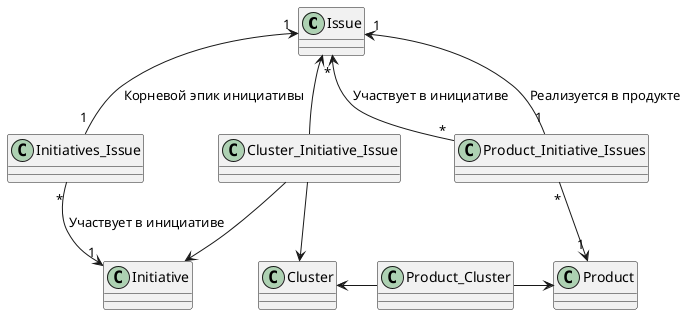
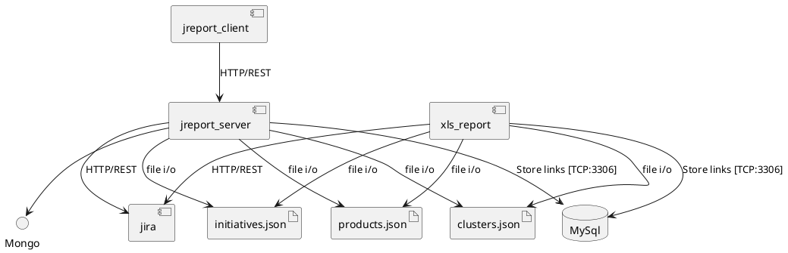

# General architecture description

## Data Model

```plantuml
@startuml
class Issue
class Cluster
class Initiative
class Product

class Initiatives_Issue
class Cluster_Initiative_Issue
class Product_Initiative_Issues
class Product_Cluster

Initiatives_Issue "1" -u-> "1" Issue : "Корневой эпик инициативы"
Initiatives_Issue "*" -d-> "1" Initiative : "Участвует в инициативе"

Cluster_Initiative_Issue -d-> Cluster : ""
Cluster_Initiative_Issue -d-> Initiative : ""
Cluster_Initiative_Issue -u-> Issue : ""

Product_Initiative_Issues "*" -d-> "1" Product
Product_Initiative_Issues "*" -u-> "*" Issue : "Участвует в инициативе"
Product_Initiative_Issues "1" -u-> "1" Issue : "Реализуется в продукте"

Product_Cluster -r-> Product : ""
Product_Cluster -l-> Cluster : ""

@enduml
```

## Components

```plantuml
@startuml

component jreport_client
component jreport_server
component xls_report
component jira
artifact clusters.json
artifact initiatives.json
artifact products.json
database MySql


jreport_client --> jreport_server : "HTTP/REST"

jreport_server --> jira : "HTTP/REST"
jreport_server --> clusters.json : "file i/o"
jreport_server --> initiatives.json : "file i/o"
jreport_server --> products.json : "file i/o"
jreport_server --> MySql : "Store links [TCP:3306]"
jreport_server --> Mongo

xls_report --> jira : "HTTP/REST"
xls_report --> clusters.json : "file i/o"
xls_report --> initiatives.json : "file i/o"
xls_report --> products.json : "file i/o"
xls_report --> MySql : "Store links [TCP:3306]"


@enduml
```